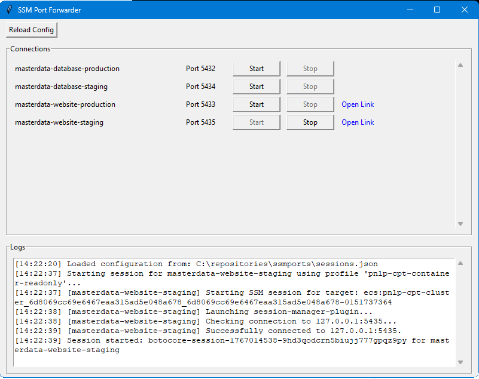

# SSM Port Forwarder

A graphical user interface for managing multiple AWS Systems Manager (SSM) port forwarding sessions simultaneously. This tool simplifies connecting to remote hosts (like RDS instances or EC2 private services) through an SSM-enabled bastion host.

Some key features:
- **Multi-session Management**: Start and stop multiple port forwarding tunnels at once.
- **Profile Support**: Use different AWS profiles for each connection.
- **Link Integration**: Define clickable links (e.g., for web consoles)

[](img/screenshot.png)

## Attribution
The core code was based on a Github request (https://github.com/boto/boto3/issues/3555) made by @JGoutin 

## Preparing Your Environment

### Prerequisites

Before using this tool, ensure you have the following installed and configured:

1.  **Python 3.12+**: Ensure Python is installed on your system.
2.  **AWS CLI**: Installed and configured, preferably AWS CLI v2. [Installation instructions here](https://docs.aws.amazon.com/cli/latest/userguide/getting-started-install.html).
.  
Optionally: 
3. **SSM Session Manager Plugin**: Bundles with AWS CLI v2, a separate installation for AWS CLI v1 users. [Install instructions here](https://docs.aws.amazon.com/systems-manager/latest/userguide/session-manager-working-with-install-plugin.html).

### Bastion requirements
You'll pivot off an existing system which will take your traffic and proxy it to another location. This is the "bastion" host, or "jump instance". There is a lot of documentation on how to set up an SSM-enabled bastion host ([for example](https://aws.amazon.com/blogs/mt/use-port-forwarding-in-aws-systems-manager-session-manager-to-connect-to-remote-hosts/)),
but there are two main configuration concerns:

*SSM agent should be installed and running*
- For EC2 and managed instances this means the AmazonSSMManagedInstanceCore policy is attached to the instance role and the SSM agent is installed and running. On EC2 most modern Amazon Linux, Ubuntu and Windows AMIs have this pre-installed.
- For ECS tasks, the AmazonECSTaskExecutionRolePolicy policy should be attached to the task role, and the SSM agent should be installed in the container image. On most linux instances Fargate will auto-inject the SSM agent.

*Network access to the target host*
- The bastion host must have network access to the target host and port you wish to connect to. For example, if connecting to an RDS instance, ensure the bastion is in the same VPC or has routing access, and that security groups allow the traffic.
- If using ECS, also ensure the task has the VPC-enabled networking mode (awsvpc) 

### AWS policies and profiles

#### Role configuration
If the role you use to run the AWS CLI with has admin access or a broad policy this won't be required, but if not: Your role needs access to the startSession permission and specifically to the `ssm:StartSession` action. [Here](https://repost.aws/questions/QUMa9_kum3Sk-fg4TL6sPfZg/policy-for-ssm-port-forwarding-session-to-remote-host) is an example IAM policy:  

```json
{
    "Version": "2012-10-17",
    "Statement": [
        {
            "Effect": "Allow",
            "Action": [
                "ssm:StartSession"
            ],
            "Resource": [
                "arn:aws:ec2:eu-west-1:your-account-id:instance/your-ec2-instance-id",
                "arn:aws:ecs:eu-west-1:your-account-id:task/your-cluster-name/*",
                "arn:aws:ssm:eu-west-1::document/AWS-StartPortForwardingSessionToRemoteHost"
            ]
        },
        {
            "Effect": "Allow",
            "Action": [
                "ssm:TerminateSession",
                "ssm:ResumeSession"
            ],
            "Resource": [
                "arn:aws:ssm:*:*:session/${aws:userid}-*"
            ]
        },{
          "Sid": "AllowContainerIdLookup",
          "Effect": "Allow",
            "Action": [
                "ecs:ListClusters",
                "ecs:DescribeClusters",
                "ecs:ListTasks",
                "ecs:DescribeTasks",
                "ecs:DescribeContainerInstances"
            ],
            "Resource": "*"
      }
    ]
}
```

#### Profiles and saml2aws
This tool assumes you are using profiles configured in your AWS CLI configuration file (`~/.aws/config` and `~/.aws/credentials`).

If your organization uses SAML-based authentication (like Okta or AD FS), I recommend to use `saml2aws` [here](https://github.com/Versent/saml2aws) or a similar tool to manage your different accounts as AWS profiles.

1.  **Configure saml2aws**: Run `saml2aws configure` to set up your identity provider details.
2.  **Login**: Before starting the SSM Port Forwarder, authenticate using:
    ```bash
    saml2aws login --profile your-profile-name
    ```
3.  **Verification**: Ensure your credentials are active by running `aws sts get-caller-identity --profile your-profile-name`.

This tool will reference these profiles when establishing connections.

## Configuring sessions.json

The application relies on a `sessions.json` file in it's working directory to define your connections. A template is provided in `sessions.json.example`.

### Example Configuration

This is a simple configuration that defines a single connection to a production database through an EC2 machine. 

This EC2 machine would:
a) Allow SSM connections (have the SSM agent installed and an IAM role attached)
b) Have network access to the RDS instance (e.g., be in the same VPC, have the right security groups, etc.)

```json
{
  "connections": {
    "Production Database": {
      "target_host": "prod-db.cluster-xxxx.eu-west-1.rds.amazonaws.com",
      "local_port": 5432,
      "remote_port": 5432,
      "profile": "my-default-profile",
      "region": "eu-west-1",
      "jump_instance": "i-0123456789abcdef0"
    }
  }
}
```

You can also set the profile, region and jump instance as root level attributes to set them as defaults for every connection. 

The jump_instance can be: 
- An EC2 instance ID (i-1234567890)
- An SSM fleet manager managed instance ID (mi-1234567890)
- An ECS instance ID (see [this bit](https://docs.aws.amazon.com/systems-manager/latest/userguide/session-manager-working-with-sessions-start.html#sessions-remote-port-forwarding) for the specific mark-up) 
- An ECS container name. This tool will attempt to resolve the container to the ECS instance ID from the profile and region provided. It will take the first result if multiple containers with the same name are found.  

Here is a more complete example showcasing multiple connections with different profiles, commands, and links:
```json
{
  "profile": "my-jump-account",
  "region": "eu-west-1",
  "jump_instance": "my-bastion-container",
  "connections": {
    "Production Database": {
      "target_host": "prod-db.cluster-xxxx.eu-west-1.rds.amazonaws.com",
      "local_port": 5432,
      "remote_port": 5432
    },
    "Staging Database": {
      "target_host": "test-db.cluster-xxxx.eu-west-1.rds.amazonaws.com",
      "local_port": 5433,
      "remote_port": 5432,
      "profile": "my-test-account",
      "jump_instance": "ecs:my-cluster_12345678901234567890123456789012_12345678901234567890123456789012-0151737364"
    },
    "RDP to Windows host": {
      "target_host": "10.0.0.1",
      "local_port": 3388,
      "remote_port": 3389,
      "command": "mstsc /v:127.0.0.1:{local_port}"
    },
    "Web UI": {
      "target_host": "10.0.0.1",
      "local_port": 8080,
      "remote_port": 80,
      "link": "http://127.0.0.1:{local_port}"
    }
  }
}
```

### Attributes

| Attribute       | Level             | Required | Description                                                                                                                     |
|:----------------|:------------------| :--- |:--------------------------------------------------------------------------------------------------------------------------------|
| `connections`   | Root              | Yes | A dictionary of connection objects. The key is the label shown in the UI.                                                       |
| `target_host`   | Connection        | Yes | The remote hostname or IP to connect to (e.g., RDS endpoint).                                                                   |
| `local_port`    | Connection        | Yes | The port on your local machine to bind the tunnel to.                                                                           |
| `remote_port`   | Connection        | Yes | The port on the remote host to forward to.                                                                                      |
| `jump_instance` | Connection / Root | Yes | The ID of the SSM-enabled instance acting as the bastion. Can be an EC2, SSM managed instance,  ECS instance or container name. |
| `profile`       | Connection / Root | No | AWS Profile to use to connect to the jump instance                                                                              |
| `region`        | Connection / Root | No | AWS Region for the jump instance                                                                                                |
| `link`          | Connection        | No | A URL that will appear as a clickable "Open Link" button. Supports `{local_port}` and `{remote_port}` placeholders.             |
| `command`       | Connection        | No | Adds a button with a command to run. Supports `{local_port}` and `{remote_port}` placeholders.                                  |
| `autostart`     | Connection        | No | If `true`, the session starts automatically when the GUI launches.                                                              |

## Usage

1.  Create your `sessions.json` file (you can use `sessions.json.example` as a starting point).
2.  Authenticate with AWS (e.g., using `saml2aws login`).
3.  Run the application, either the release executable or via Python:
    ```bash
    python gui.py
    ```
4.  Click **Start** to open a tunnel.
5.  Click **Open Link** or **Run Command** (if configured) to access the service.
6.  Click **Reload Config** if you make changes to `sessions.json` while the app is running.

## Building a Standalone Executable

To create a standalone executable that doesn't require Python to be installed:

1. Ensure you have the development dependencies installed:
   ```bash
   poetry install --with dev
   ```

2. Run the build script:
   ```bash
   build.bat
   ```

   Or manually:
   ```bash
   pip install https://github.com/pyinstaller/pyinstaller/archive/develop.zip
   pyinstaller ssmports.spec
   ```

3. The executable will be created in the `dist/` directory as `ssmports.exe`.

Note: The executable includes all necessary dependencies and data files, making it portable.
